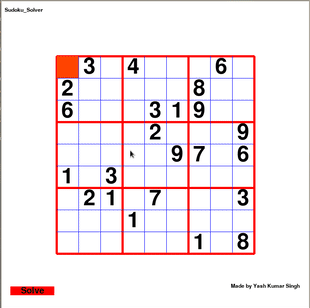

# sudoku-solver-gui
- It's uses backtracking and genarator in python.
- All The Blocks are clickable and you can also try to solve it.
- click Solve or press ENTER to solve problem.

# How to solve
- When you start to solve it Timer will start.
- You Can only make 3 mistake.
